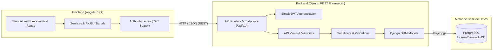
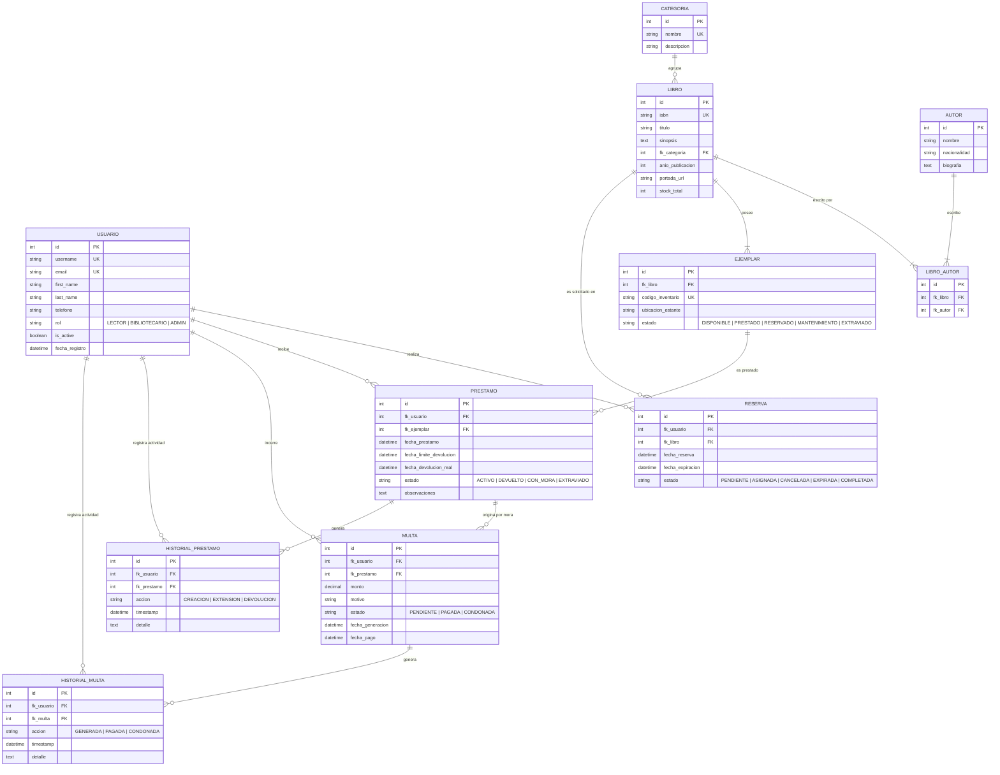
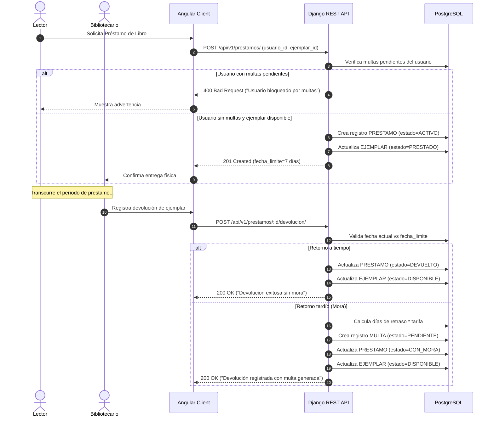

# 🏛️ Documento de Arquitectura de Software
## Sistema de Biblioteca Digital y Gestión de Préstamos

> **Stack Tecnológico:** Django 5+ / Django REST Framework (DRF) · PostgreSQL · Angular 17+ (Standalone Components) · TypeScript

---

## 1. 📋 Diagnóstico del Proyecto Actual

Al inspeccionar el repositorio actual (`DOAP - copia`), se identificó lo siguiente:

| Componente | Estado Actual | Observación y Recomendación |
| :--- | :--- | :--- |
| **Arquitectura** | Híbrida (Monolito con plantillas Django + inicio de API) | Hay vistas que renderizan HTML con `render()` en [views.py](file:///c:/Users/USUARIO/Desktop/DOAP%20-%20copia/pagina_principal/views.py) y carpetas [templates/](file:///c:/Users/USUARIO/Desktop/DOAP%20-%20copia/templates/) y [static/](file:///c:/Users/USUARIO/Desktop/DOAP%20-%20copia/static/). Al pasar a **Angular**, Django debe funcionar **exclusivamente como API REST** (JSON). |
| **Modelos** | Modelo `Usuario` básico en [models.py](file:///c:/Users/USUARIO/Desktop/DOAP%20-%20copia/pagina_principal/models.py) | La contraseña se guarda en texto plano (`CharField`). Se debe reemplazar por un modelo que herede de `AbstractUser` de Django para aprovechar el hash seguro de contraseñas, roles (Lector, Bibliotecario, Administrador) y autenticación JWT. |
| **Base de Datos** | PostgreSQL configurado en [settings.py](file:///c:/Users/USUARIO/Desktop/DOAP%20-%20copia/config/settings.py) | Conexión a `LibreriaDesarrolloDB`. La base teórica en `DB/Base de Datos.xlsx` (hojas 1FN y 2FN) contiene la normalización adecuada para libros, ejemplares, reservas, préstamos y multas. Falta traducirla a modelos ORM de Django. |
| **Frontend** | Plantillas HTML/JS nativas; no hay proyecto Angular inicializado | En [settings.py](file:///c:/Users/USUARIO/Desktop/DOAP%20-%20copia/config/settings.py) ya está configurado `corsheaders`, pero apunta a `https://localhost:4200` (Angular CLI corre por defecto en `http://localhost:4200`). |

---

## 2. 🏗️ Arquitectura General del Sistema

El sistema implementa una **Arquitectura Desacoplada (Cliente - Servidor)**:



---

## 3. 📂 Estructura de Carpetas Propuesta

Para mantener el principio de responsabilidad única y escalabilidad, se recomienda organizar la solución en un repositorio con separación clara entre backend y frontend:

```text
DOAP/
├── backend/                             # Proyecto Django REST Framework
│   ├── manage.py
│   ├── config/                          # Configuración global del backend
│   │   ├── __init__.py
│   │   ├── asgi.py
│   │   ├── settings.py                  # CORS, JWT, BD, Apps
│   │   ├── urls.py                      # Enrutamiento maestro (/api/v1/)
│   │   └── wsgi.py
│   ├── apps/                            # Aplicaciones modulares por dominio
│   │   ├── usuarios/                    # Auth, Roles, Perfiles
│   │   │   ├── models.py                # CustomUser, Perfil
│   │   │   ├── serializers.py
│   │   │   ├── views.py
│   │   │   ├── urls.py
│   │   │   └── permissions.py
│   │   ├── catalogo/                    # Libros, Autores, Categorías, Ejemplares
│   │   │   ├── models.py                # Libro, Autor, Categoria, Ejemplar
│   │   │   ├── serializers.py
│   │   │   ├── views.py
│   │   │   └── urls.py
│   │   ├── prestamos/                   # Reservas y Préstamos
│   │   │   ├── models.py                # Reserva, Prestamo, HistorialPrestamo
│   │   │   ├── serializers.py
│   │   │   ├── views.py
│   │   │   ├── urls.py
│   │   │   └── services.py              # Lógica de cálculo de fechas y stock
│   │   └── multas/                      # Multas y Sanciones
│   │       ├── models.py                # Multa, TipoMulta, HistorialMulta
│   │       ├── serializers.py
│   │       ├── views.py
│   │       ├── urls.py
│   │       └── services.py              # Cálculo automático de tarifas por mora
│   ├── requirements.txt                 # Dependencias Python
│   └── media/                           # Portadas de libros y documentos subidos
│
├── frontend/                            # Cliente Angular 17+
│   ├── angular.json
│   ├── package.json
│   ├── tsconfig.json
│   └── src/
│       ├── index.html
│       ├── main.ts
│       ├── styles.css                   # Estilos globales o Tailwind/Bootstrap
│       └── app/
│           ├── app.component.ts
│           ├── app.config.ts            # Proveedores (HttpClient, Router, Interceptors)
│           ├── app.routes.ts            # Rutas del sistema
│           │
│           ├── core/                    # Singleton: Auth, Guards, Interceptors
│           │   ├── guards/
│           │   │   ├── auth.guard.ts
│           │   │   └── role.guard.ts    # Valida rol (lector vs bibliotecario)
│           │   ├── interceptors/
│           │   │   ├── auth.interceptor.ts  # Inyecta token JWT Bearer
│           │   │   └── error.interceptor.ts # Manejo global de HTTP 401/403/500
│           │   └── services/
│           │       └── auth.service.ts      # Login, Refresh token, CurrentUser
│           │
│           ├── shared/                  # Componentes reutilizables, Pipes, Directivas
│           │   ├── components/
│           │   │   ├── navbar/
│           │   │   ├── footer/
│           │   │   ├── book-card/
│           │   │   └── alert-modal/
│           │   └── pipes/
│           │       └── safe-url.pipe.ts
│           │
│           ├── features/                # Módulos funcionales de negocio
│           │   ├── auth/                # Login, Registro de usuarios
│           │   │   ├── pages/login/
│           │   │   └── pages/register/
│           │   ├── catalogo/            # Exploración y detalle de libros
│           │   │   ├── pages/catalogo-list/
│           │   │   ├── pages/libro-detail/
│           │   │   └── services/catalogo.service.ts
│           │   ├── reservas/            # Gestión de reservas del usuario y admin
│           │   │   ├── pages/mis-reservas/
│           │   │   └── services/reserva.service.ts
│           │   ├── prestamos/           # Préstamos activos, devoluciones
│           │   │   ├── pages/mis-prestamos/
│           │   │   ├── pages/gestion-prestamos/  # Vista para Bibliotecarios
│           │   │   └── services/prestamo.service.ts
│           │   ├── multas/              # Multas activas y pasarela de pago/condonación
│           │   │   ├── pages/mis-multas/
│           │   │   └── services/multa.service.ts
│           │   └── admin/               # Panel administrativo / CRUDs
│           │       ├── pages/dashboard/
│           │       ├── pages/crud-libros/
│           │       └── pages/crud-ejemplares/
│           │
│           └── models/                  # Interfaces TypeScript alineadas con Backend
│               ├── usuario.model.ts
│               ├── libro.model.ts
│               ├── ejemplar.model.ts
│               ├── reserva.model.ts
│               ├── prestamo.model.ts
│               └── multa.model.ts
```

---

## 4. 🗄️ Modelo de Datos (PostgreSQL / Django ORM)

Basado en las formas normales analizadas en el archivo de diseño (`DB/Base de Datos.xlsx`), esta es la estructura entidad-relación normalizada:

### 4.1. Diagrama Entidad-Relación (Mermaid ERD)



### 4.2. Explicación de Decisiones Clave en la BD

1. **Distinción entre `Libro` y `Ejemplar` (Patrón Físico vs Metadato):**
   - Un `Libro` contiene información bibliográfica compartida (Título, ISBN, Categoría, Autores).
   - Un `Ejemplar` representa la unidad física concreta con código de barras propio (`codigo_inventario`) y estado individual. No se presta el concepto "Libro", se presta un `Ejemplar` físico determinado.
2. **Relación M:N entre Libros y Autores:**
   - Un libro puede tener varios coautores y un autor puede escribir múltiples libros.
3. **Flujo de Reservas:**
   - Una reserva se hace sobre un `Libro`. Cuando un `Ejemplar` se vuelve disponible, el sistema lo asigna a la reserva más antigua en cola con un tiempo de caducidad (ej. 48 horas para recogerlo).
4. **Cálculo de Multas:**
   - Si `fecha_devolucion_real > fecha_limite_devolucion`, el sistema calcula:
     $$\text{Monto} = (\text{Días de retraso}) \times \text{Tarifa diaria}$$
   - El préstamo pasa a estado `CON_MORA` y se bloquean nuevas reservas para el usuario mientras tenga multas `PENDIENTE`.

---

## 5. 🔌 Especificación de la API REST (Django REST Framework)

### Autenticación y Cuentas (`/api/v1/auth/`)
| Método | Endpoint | Descripción | Acceso |
| :--- | :--- | :--- | :--- |
| `POST` | `/api/v1/auth/login/` | Obtiene par de tokens JWT (`access` y `refresh`) | Público |
| `POST` | `/api/v1/auth/refresh/` | Refresca el token JWT expirado | Público |
| `POST` | `/api/v1/auth/registro/` | Registro de nuevos lectores | Público |
| `GET` | `/api/v1/auth/perfil/` | Obtiene datos del usuario autenticado | Autenticado |
| `PUT` | `/api/v1/auth/perfil/` | Actualiza información personal | Autenticado |

### Catálogo de Libros y Autores (`/api/v1/catalogo/`)
| Método | Endpoint | Descripción | Acceso |
| :--- | :--- | :--- | :--- |
| `GET` | `/api/v1/catalogo/libros/` | Lista paginada con filtros (título, autor, categoría, disponibilidad) | Público |
| `GET` | `/api/v1/catalogo/libros/<id>/` | Detalle del libro con autores y ejemplares disponibles | Público |
| `POST` | `/api/v1/catalogo/libros/` | Crear libro | Bibliotecario / Admin |
| `PUT/PATCH` | `/api/v1/catalogo/libros/<id>/` | Modificar libro | Bibliotecario / Admin |
| `DELETE` | `/api/v1/catalogo/libros/<id>/` | Eliminar libro (baja lógica) | Admin |
| `GET/POST` | `/api/v1/catalogo/autores/` | Listar y crear autores | Lectura pública / Escritura Admin |
| `GET/POST` | `/api/v1/catalogo/categorias/` | Listar y crear categorías | Lectura pública / Escritura Admin |
| `GET/POST` | `/api/v1/catalogo/ejemplares/` | Inventario físico de ejemplares | Bibliotecario / Admin |

### Reservas (`/api/v1/reservas/`)
| Método | Endpoint | Descripción | Acceso |
| :--- | :--- | :--- | :--- |
| `GET` | `/api/v1/reservas/mis-reservas/` | Listado de reservas del usuario en sesión | Lector |
| `POST` | `/api/v1/reservas/` | Crear solicitud de reserva para un libro | Lector |
| `PATCH` | `/api/v1/reservas/<id>/cancelar/` | Cancelar reserva pendiente | Propietario / Admin |
| `GET` | `/api/v1/reservas/` | Listado global para gestión de biblioteca | Bibliotecario / Admin |

### Préstamos (`/api/v1/prestamos/`)
| Método | Endpoint | Descripción | Acceso |
| :--- | :--- | :--- | :--- |
| `GET` | `/api/v1/prestamos/mis-prestamos/` | Préstamos activos e historial del usuario | Lector |
| `POST` | `/api/v1/prestamos/` | Registrar salida de un ejemplar a un usuario | Bibliotecario |
| `POST` | `/api/v1/prestamos/<id>/devolucion/` | Registrar retorno físico y calcular mora | Bibliotecario |
| `POST` | `/api/v1/prestamos/<id>/renovar/` | Extender fecha de devolución si no hay reservas | Lector / Admin |

### Multas e Historial (`/api/v1/multas/`)
| Método | Endpoint | Descripción | Acceso |
| :--- | :--- | :--- | :--- |
| `GET` | `/api/v1/multas/mis-multas/` | Multas pendientes y pagadas del lector | Lector |
| `GET` | `/api/v1/multas/` | Gestión global de multas | Bibliotecario / Admin |
| `PATCH` | `/api/v1/multas/<id>/pagar/` | Registrar pago o condonación | Bibliotecario / Admin |
| `GET` | `/api/v1/historial/usuario/<id>/` | Trazabilidad completa de auditoría | Bibliotecario / Admin |

---

## 6. 💻 Arquitectura del Frontend en Angular (17+)

### 6.1. Principios Técnicos
- **Standalone Components:** Sin módulos tradicionales `NgModule`, menor boilerplate y lazy loading por ruta directo.
- **Signals y RxJS:** Uso de `signal()` para estado reactivo local (estado del carrito de préstamos, filtros de búsqueda) y `HttpClient` con RxJS para llamadas de API.
- **HTTP Interceptor:**
  ```typescript
  // core/interceptors/auth.interceptor.ts
  export const authInterceptor: HttpInterceptorFn = (req, next) => {
    const authService = inject(AuthService);
    const token = authService.getToken();
    if (token) {
      req = req.clone({
        setHeaders: { Authorization: `Bearer ${token}` }
      });
    }
    return next(req);
  };
  ```
- **Rutas y Lazy Loading:**
  ```typescript
  // app.routes.ts
  export const routes: Routes = [
    { path: '', loadComponent: () => import('./features/catalogo/pages/catalogo-list/catalogo-list.component') },
    { path: 'libro/:id', loadComponent: () => import('./features/catalogo/pages/libro-detail/libro-detail.component') },
    { path: 'login', loadComponent: () => import('./features/auth/pages/login/login.component') },
    { 
      path: 'panel', 
      canActivate: [authGuard],
      children: [
        { path: 'reservas', loadComponent: () => import('./features/reservas/pages/mis-reservas/mis-reservas.component') },
        { path: 'prestamos', loadComponent: () => import('./features/prestamos/pages/mis-prestamos/mis-prestamos.component') },
        { path: 'multas', loadComponent: () => import('./features/multas/pages/mis-multas/mis-multas.component') },
      ]
    },
    { 
      path: 'admin', 
      canActivate: [authGuard, roleGuard], 
      data: { roles: ['BIBLIOTECARIO', 'ADMIN'] },
      loadChildren: () => import('./features/admin/admin.routes') 
    }
  ];
  ```

---

## 7. 🔄 Flujos de Negocio Principales

### 7.1. Flujo de Préstamo y Devolución



---

## 8. 🗺️ Plan de Implementación Paso a Paso

1. **Fase 1: Preparación del Backend Django**
   - Instalar `djangorestframework-simplejwt` y `django-cors-headers`.
   - Crear las apps especializadas: `python manage.py startapp usuarios`, `python manage.py startapp catalogo`, `python manage.py startapp prestamos`, `python manage.py startapp multas`.
   - Definir los modelos ORM en cada app y generar las migraciones (`makemigrations` y `migrate`).
   - Configurar [settings.py](file:///c:/Users/USUARIO/Desktop/DOAP%20-%20copia/config/settings.py) para CORS (`http://localhost:4200`) y configuración JWT.

2. **Fase 2: Serializadores y Endpoints REST**
   - Crear `ModelSerializer` y `ModelViewSet` en cada app.
   - Definir permisos (`IsAuthenticated`, `IsAdminUser`, permisos personalizados por rol).
   - Probar endpoints mediante Swagger/OpenAPI (`drf-spectacular`) o Postman.

3. **Fase 3: Inicialización del Frontend Angular**
   - Generar el proyecto: `ng new frontend --routing --style=css --standalone`.
   - Configurar `app.config.ts` con `provideHttpClient(withInterceptors([authInterceptor]))`.
   - Crear las interfaces en `models/` y servicios base en `core/services/`.

4. **Fase 4: Desarrollo de Componentes y Vistas**
   - Pantalla de Catálogo con buscador reactivo y filtros por categoría/autor.
   - Módulo de autenticación (Login y Registro con validación de formularios reactivos).
   - Panel de usuario: Mis Préstamos, Mis Reservas y Mis Multas.
   - Panel administrativo para bibliotecarios: control de ejemplares, devoluciones y cobro de multas.

5. **Fase 5: Despliegue y Pruebas**
   - Poblar datos iniciales con fixtures o scripts de carga (migrar datos de ejemplo a PostgreSQL).
   - Pruebas unitarias de cálculo de multas y asignación de reservas concurrentes.

